# E-Commerce Capstone — Java Microservices on OpenShift

Three independently deployable Spring Boot microservices and a static frontend, each
service owning its own PostgreSQL database, built by Maven, containerised, and deployed
to OpenShift through a Tekton pipeline that pushes images to the OpenShift Container
Registry.

**Author:** Mohammed Riyaz Khan
**Repository:** https://github.com/riyazkhanibm/ecommerce-capstone
**Cluster:** Red Hat OpenShift Developer Sandbox — project `riyazkhan03-dev`

---

## Contents

- [Architecture](#architecture)
- [Technology stack](#technology-stack)
- [Repository layout](#repository-layout)
- [Running locally](#running-locally)
- [Deploying to OpenShift](#deploying-to-openshift)
- [CI/CD pipeline](#cicd-pipeline)
- [Automated triggering](#automated-triggering)
- [Verification evidence](#verification-evidence)
- [Fixes and adaptations](#fixes-and-adaptations)
- [Design discussion](#design-discussion)

---

## Architecture

| Component | Stack | Port | Database |
|---|---|---|---|
| `product-service` | Java 17 / Spring Boot 3 | 8081 | `productdb` |
| `order-service` | Java 17 / Spring Boot 3 | 8082 | `orderdb` |
| `user-service` | Java 17 / Spring Boot 3 | 8083 | `userdb` |
| `frontend` | static HTML/JS on nginx | 8080 | — |

Each service owns its own schema. No service reads another service's tables — all
cross-service communication is over HTTP. Placing an order causes `order-service` to
call `product-service` to validate stock, persist the order in its own database, then
call back to decrement stock.

<!-- Optional: an architecture diagram would go here -->

---

## Technology stack

Java 17, Maven 3.9, Spring Boot 3.2, PostgreSQL 15/16, Docker + Docker Compose,
OpenShift 4, OpenShift Container Registry, Tekton Pipelines and Triggers, GitHub.

---

## Repository layout

```
ecommerce-capstone/
├── services/                    Java source, one folder per microservice
│   ├── product-service/
│   ├── order-service/
│   └── user-service/
├── frontend/                    static HTML/JS + nginx
├── db/                          local Compose database init script
├── docker-compose.yml           full local stack
├── openshift/                   Deployment / Service / Route / PVC / Secret
│   └── builds/                  BuildConfigs + ImageStreams (added)
├── tekton/                      Pipelines, Tasks, PipelineRuns, Triggers
│   ├── tasks/
│   └── triggers/                path-filtered GitHub triggers (added)
├── docs/                        architecture, setup, verification, fixes
└── evidence/                    verification screenshots
```

---

## Running locally

Requires JDK 17, Maven 3.9+, Docker with Compose v2.

```bash
# 1. Build all three services
cd services/product-service && mvn -B clean package -DskipTests && cd ../..
cd services/order-service   && mvn -B clean package -DskipTests && cd ../..
cd services/user-service    && mvn -B clean package -DskipTests && cd ../..

# 2. Bring up the full stack
docker compose up -d --build
docker compose ps
```

Toolchain in place:

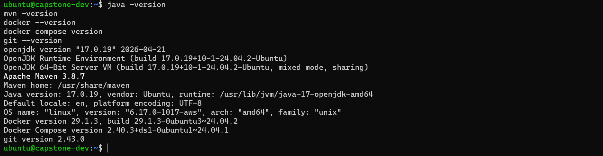

All three services compile:

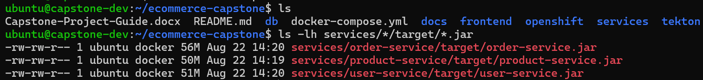

Five containers running:

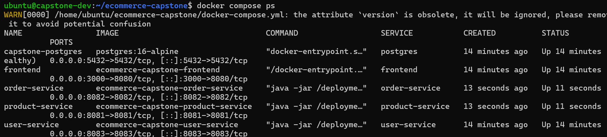

### Exercising the API

```bash
curl -s localhost:8081/api/products

curl -s -X POST localhost:8083/api/auth/register \
  -H 'Content-Type: application/json' \
  -d '{"fullName":"Mohammed Riyaz Khan","email":"riyaz@example.com","password":"Passw0rd1"}'

curl -s -X POST localhost:8082/api/orders \
  -H 'Content-Type: application/json' \
  -d '{"customerName":"Riyaz","items":[{"productId":1,"quantity":2}]}'

curl -s localhost:8081/api/products/1     # stockQuantity has dropped by 2
```

Browser at `http://<host>:3000`, with the three service URLs entered in the endpoint
fields at the top of the page:

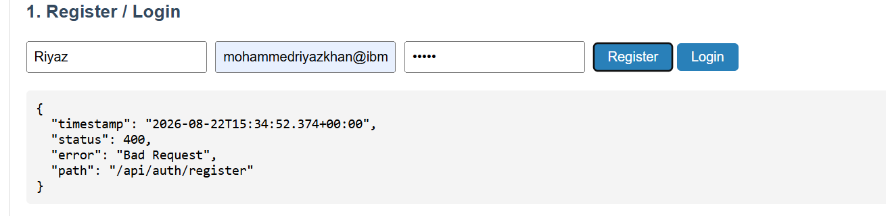

Source pushed to GitHub:

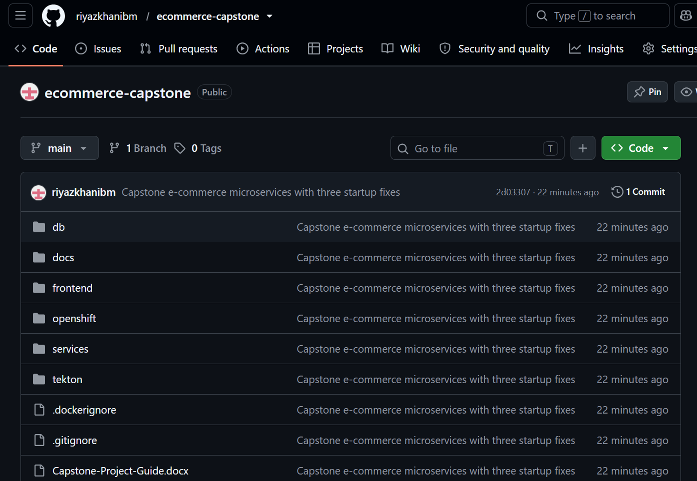

---

## Deploying to OpenShift

### 1. Secrets

Generated rather than applied from the checked-in templates, so no real credential is
ever committed:

```bash
oc create secret generic product-db-credentials \
  --from-literal=POSTGRESQL_USER=capstone \
  --from-literal=POSTGRESQL_PASSWORD=$(openssl rand -hex 12) \
  --from-literal=POSTGRESQL_DATABASE=productdb
# repeated for order-db-credentials and user-db-credentials

oc create secret generic user-service-jwt \
  --from-literal=JWT_SECRET=$(openssl rand -hex 32)
```

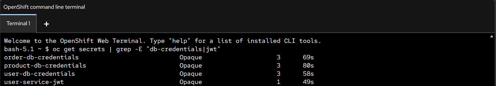

### 2. Databases

```bash
oc apply -f openshift/postgres/
```

Three PostgreSQL Deployments, each with its own PVC and Service:

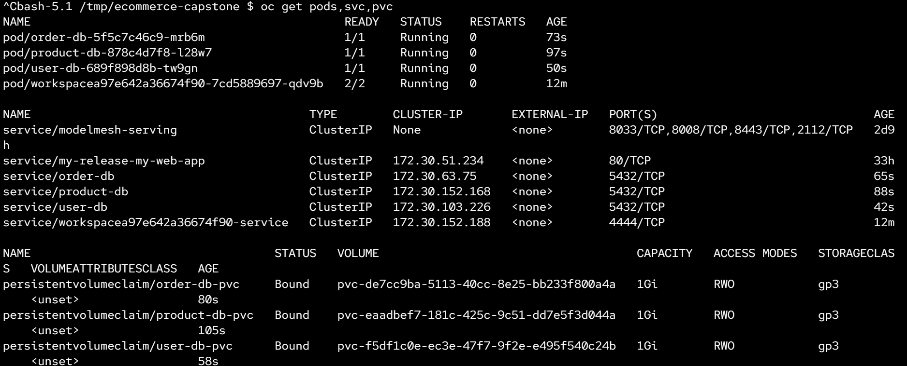

### 3. Images

BuildConfigs build each component's Dockerfile and push to the internal registry:

```bash
oc apply -f openshift/builds/buildconfigs.yaml
oc start-build product-service --follow
```

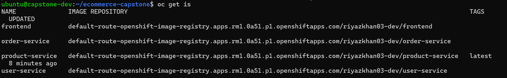

### 4. Applications

```bash
oc apply -f openshift/product-service/
oc apply -f openshift/order-service/
oc apply -f openshift/user-service/
oc apply -f openshift/frontend/
```

Seven application pods, four Services, four TLS-terminated Routes:

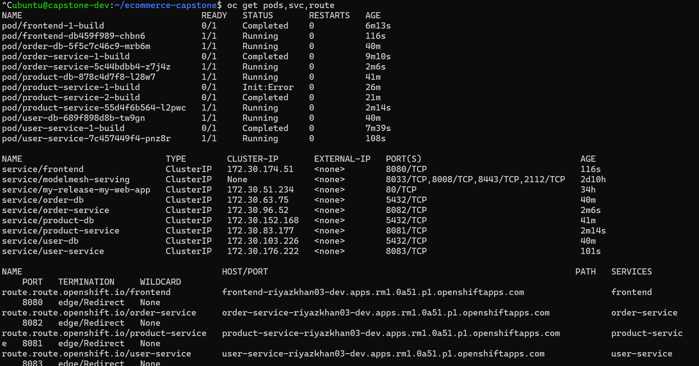

Live endpoints:

| Component | URL |
|---|---|
| Frontend | https://frontend-riyazkhan03-dev.apps.rm1.0a51.p1.openshiftapps.com |
| product-service | https://product-service-riyazkhan03-dev.apps.rm1.0a51.p1.openshiftapps.com |
| order-service | https://order-service-riyazkhan03-dev.apps.rm1.0a51.p1.openshiftapps.com |
| user-service | https://user-service-riyazkhan03-dev.apps.rm1.0a51.p1.openshiftapps.com |

The three service URLs are entered into the endpoint fields at the top of the frontend page.

### 5. Verification through the Routes

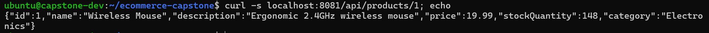

End-to-end order placed in a real browser, through the cluster:

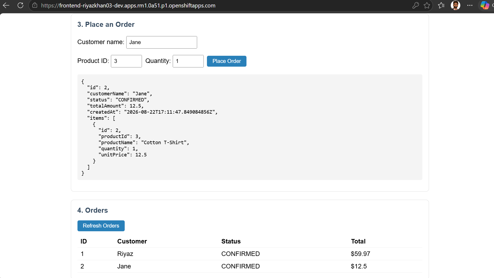

---

## CI/CD pipeline

`capstone-build-deploy` runs four stages:

| Stage | Task | Does |
|---|---|---|
| 1 | `git-clone` | Clones the repository at a specific commit |
| 2 | `maven-build` | `mvn clean package` **with tests** — fails fast |
| 3 | `oc-build` | Starts the component's BuildConfig; image lands in OCR |
| 4 | `openshift-client` | Rolls out the Deployment and waits for readiness |

A second pipeline, `capstone-build-nomaven`, drops stage 2 for the frontend, which has
no `pom.xml`.

```bash
oc create -f tekton/pipelinerun-product-service.yaml
tkn pipelinerun logs -f -L
```

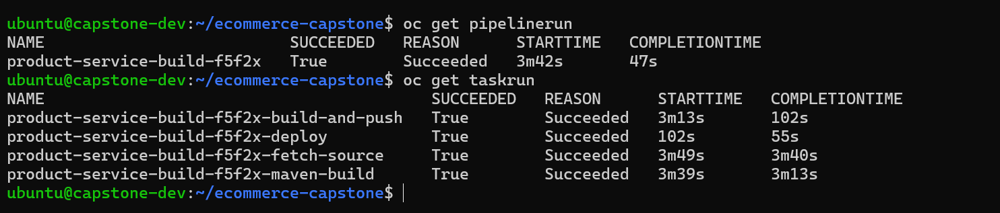

All three services built and deployed through the pipeline:

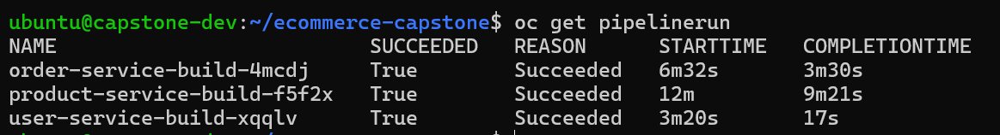

---

## Automated triggering

A GitHub webhook posts to a Tekton `EventListener` exposed through a Route. The
`github` interceptor validates the HMAC signature against a shared secret, and a CEL
interceptor filters on the changed file paths so only the affected component rebuilds.

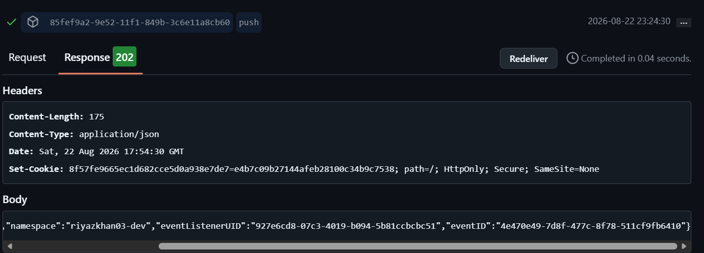

A push touching only `services/order-service/` triggers exactly one pipeline —
`product-service`, `user-service` and `frontend` stay untouched:

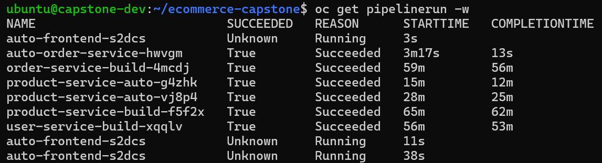

<!-- Optional, if you kept the frontend screenshot:
A push touching only `frontend/` runs the three-stage no-Maven pipeline:


-->

---

## Verification evidence

| # | Evidence | Requirement |
|---|---|---|
| 01 | Toolchain versions | environment |
| 02 | Maven builds succeed | **Maven build** |
| 03 | Docker Compose stack up | **local stack** |
| 04 | Local API flow | **local stack** |
| 05 | Local browser order | **local stack** |
| 06 | GitHub repository | **source in GitHub** |
| 07 | OpenShift secrets | cluster setup |
| 08 | Databases running | **database** |
| 09 | Images in OCR | **OpenShift Container Registry** |
| 10 | All pods running | **OpenShift cluster** |
| 11 | API flow via Routes | **microservices** |
| 12 | Browser end to end | **browser verification** |
| 13 | PipelineRun succeeded | **Tekton pipeline** |
| 14 | All three PipelineRuns | **Tekton pipeline** |
| 15 | Webhook configured | stretch goal |
| 16 | Path-filtered trigger | stretch goal |

---

## Fixes and adaptations

Eight issues were found and resolved. Full detail in
[`docs/FIXES.md`](docs/FIXES.md).

**Defects in the supplied source** — the first two prevented services from starting at
all, on any machine:

1. `product-service` — `data.sql` executed before Hibernate created the schema.
   Fixed with `spring.jpa.defer-datasource-initialization: true`.
2. `order-service` — the `@Bean` method `productServiceClient()` collided with the
   `@Component` class `ProductServiceClient`. Renamed to `productWebClient`.
3. `order-service` — `Order` and `OrderItem` reference each other, producing an
   unbounded JSON cycle on every order response. Added `@JsonIgnore` to the
   back-reference.

**Platform adaptations** — required because the account is namespace-scoped, not
cluster-admin:

4. The `buildah` Task needs the `privileged` SCC. Replaced with an `oc-build` Task
   that starts an OpenShift BuildConfig, delegating the privileged work to the
   platform's build controller.
5. `contextDir` on a BuildConfig conflicts with `oc start-build --from-dir`, which
   uploads the context directly. Removed.
6. The `EventListener` needs cluster-scoped access to `clusterinterceptors`, which a
   namespaced Role cannot grant. Switched to the operator-provided `pipeline`
   ServiceAccount.
7. The EventListener Route, created with `oc expose`, had no TLS termination and
   returned 503 to GitHub's HTTPS POSTs. Recreated with `oc create route edge`.
8. An unfiltered webhook rebuilt every component on every push. Added CEL path
   filters so each trigger fires only for its own directory.

---

## Design discussion

### Cross-service writes

Placing an order spans two services and two databases. This project uses a
**synchronous call**: `order-service` validates stock, saves the order, then calls
`product-service` to decrement. It is readable, gives the customer an immediate answer,
and needs no extra infrastructure.

The trade-off is real. If the order saves but the decrement call fails, stock and
orders disagree — this is not a distributed transaction. `order-service` also cannot
place any order while `product-service` is down.

The alternative is an **event-driven saga**: save the order as `PENDING`, publish an
event, let `product-service` reserve stock and publish back. That decouples the
services and scales to more participants, at the cost of running a broker and giving
the customer eventual rather than immediate confirmation. The code isolates the
outbound call in `ProductServiceClient`, so the swap is localised to one class.

### Privilege delegation

The most interesting constraint was the image build. `buildah` builds inside the
pipeline pod and therefore needs privileged access — which a namespace-scoped account
cannot be granted, since Kubernetes RBAC forbids escalating beyond your own rights.

An OpenShift BuildConfig inverts this: rather than granting the pipeline privilege, it
asks a platform controller that already holds it to perform one narrowly-defined task.
The pipeline stays unprivileged and the image still reaches the registry. This is the
same pattern as a setuid binary — a narrow interface to an elevated executor, with no
privilege handed to the caller — and it is the correct approach on any multi-tenant
cluster, not a workaround.
